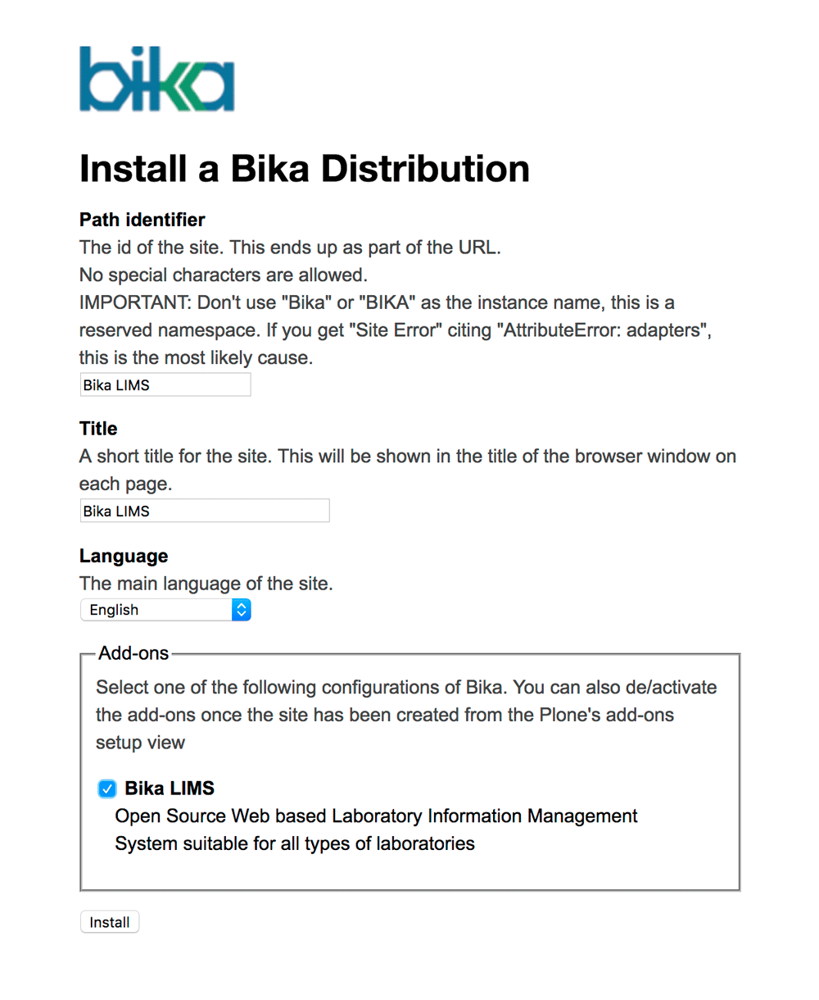
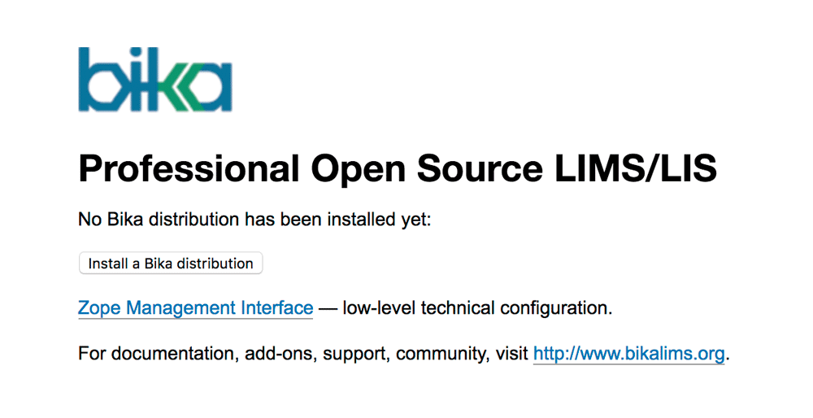
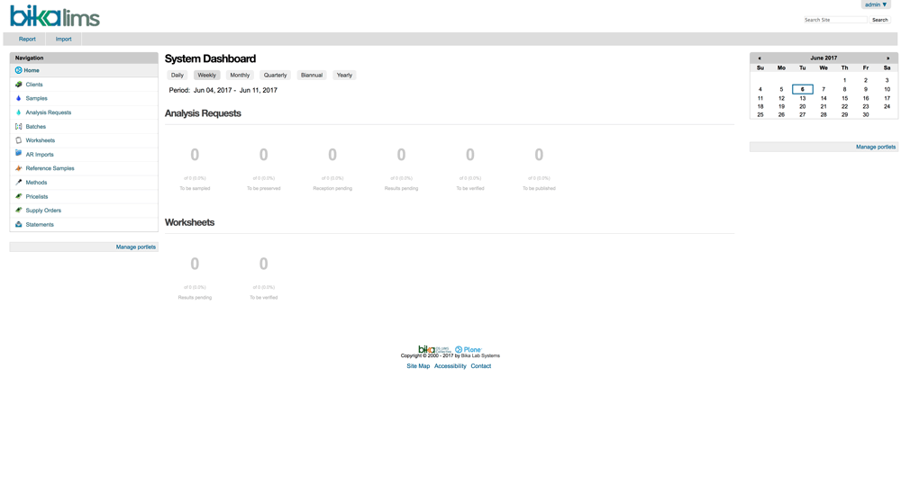

## Bika LIMS Installation Instructions 

* Install the Bika LIMS application from the BIBBOX store and wait for the logs to stop moving.

* Open up the application by clicking the application tile header in the Applications menu, or the dashboard/logs view.

* If BIBBOX finished the installation of Bika LIMS in the system, you will see the first setup screen. Here, click on **Install a Bika distribution** and enter the default login credentials **admin** / **admin**.

    
    
* You can now choose a **Path identifier** (Do not choose "Bika" or "BIKA" for this) and a **Title** for your page as well as the default **Language**. It is very important, that you check the checkbox for **Bika LIMS** at the **Add-ons** section before you finally click the **Install** button.

    
    
* After some loading time you will now see the Bika LIMS dashboard view and your application is ready to use!

    

## After the installation

Have a nice ride with the new Admins youngtimer.

